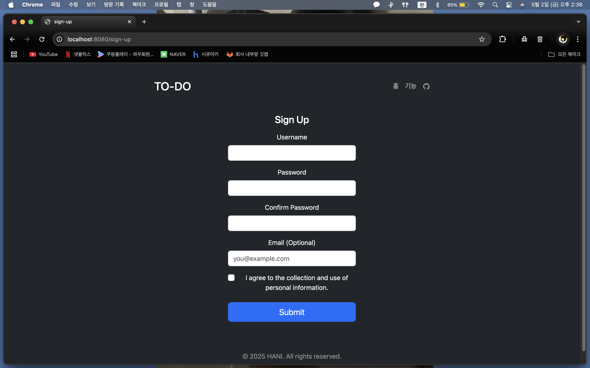
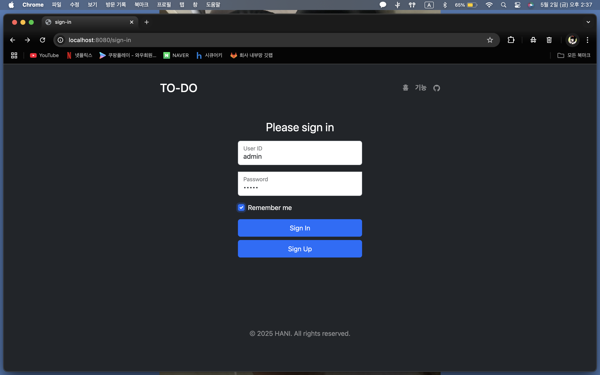
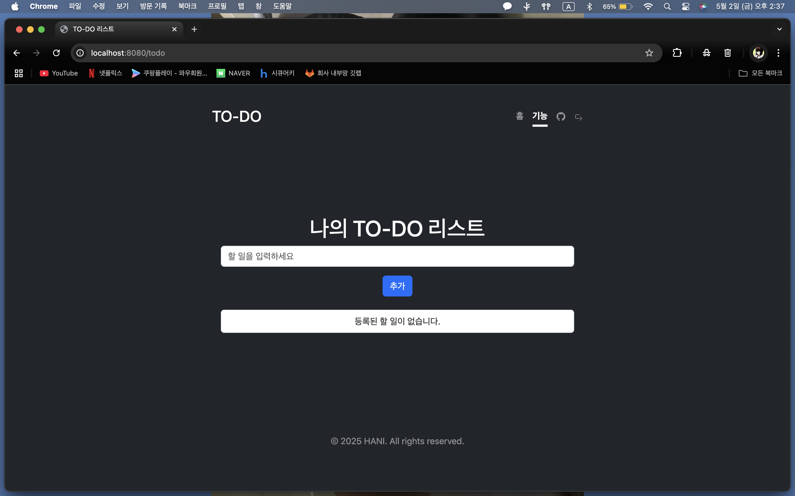

# Node.js, Express, MongoDB를 이용한 간단한 TO-DO 프로젝트

이 프로젝트는 Node.js, Express, MongoDB를 사용하여 만든 간단한 TO-DO 리스트 웹 애플리케이션입니다. 사용자는 회원가입, 로그인, 그리고 TO-DO 항목을 추가 및 관리할 수 있습니다.

---
## ▶ 개발 환경
`Node.js`: v22.14.0

`npm`: v10.9.2

`MongoDB`: v8.0.6 (community edition)

`mongosh`: v2.4.2

---
## 디렉토리 구조
```bash
TODO-LIST/                      # 프로젝트 루트
├── docs/                       # 문서 디렉토리
│   └── img/                    # 문서에 사용되는 이미지
├── public/                     # 정적 파일 (css,js,img)
│   ├── css/                    
│   ├── img/                    
│   └── js/                     
├── src/                        # 애플리케이션 소스
│   ├── config/                 # 설정 파일 (db,session)
│   ├── controllers/            # 요청 처리 로직 
│   ├── middlewares/            # 미들웨어 로직 (유효성 검사)
│   ├── models/                 # DB 모델 정의 
│   ├── routes/                 # 라우터 정의 
│   ├── services/               # 비즈니스 로직
│   └── views/                  # 뷰 템플릿 (EJS)
│       ├── auth/               # 로그인/회원가입 뷰
│       ├── common/             # 공통 레이아웃 (헤더,푸터)
│       └── todo/               # TODO 관련 뷰
├── index.js                    # 엔트리 포인트
├── package-lock.json           # 의존성 잠금 파일
├── package.json                # 프로젝트 설정 및 의존성
└── README.md                   # 프로젝트 설명 문서
```
---
## 📦 설치 방법

**1. git clone 합니다.**
```bash
    git clone https://github.com/glsl7503/Todo-list.git
```

**2. 의존성을 설치합니다.**
```bash
    npm install
```

**3. MongoDB 실행**
MongoDB 서버가 실행 중이어야 합니다. 터미널에서 아래 명령어로 MongoDB를 실행할 수 있습니다.
```bash
    mongod
```

---
## ⚙️ 사용법
## Step1. 회원가입


## Step2. 로그인


## Step3. TO-DO 추가


---
## 기여 방법

1. **이 프로젝트를 Fork 하세요**  
   GitHub에서 이 프로젝트를 Fork 하여 자신의 저장소로 복사합니다.

2. **새로운 브랜치 만들기**  
   `git checkout -b feature/name` 명령어로 새로운 브랜치를 만듭니다.  
   예: `git checkout -b add-login-feature`

3. **변경 사항 추가**  
   원하는 기능을 추가하거나 버그를 수정한 후, 변경 사항을 커밋합니다.  
   예: `git commit -m "Add login feature"`

4. **브랜치 푸시**  
   변경 사항을 자신의 GitHub 저장소에 푸시합니다.  
   예: `git push origin feature-name`

5. **Pull Request 열기**  
   GitHub에서 원본 저장소로 가서 **Pull Request**를 생성합니다.  
   Pull Request에 변경 사항에 대한 설명을 추가해주세요.

6. **리뷰 및 승인**  
   Pull Request가 리뷰되면, 문제가 없으면 머지가 진행됩니다.

---
## 참고

MongoDB 공식 문서: https://www.mongodb.com/docs
